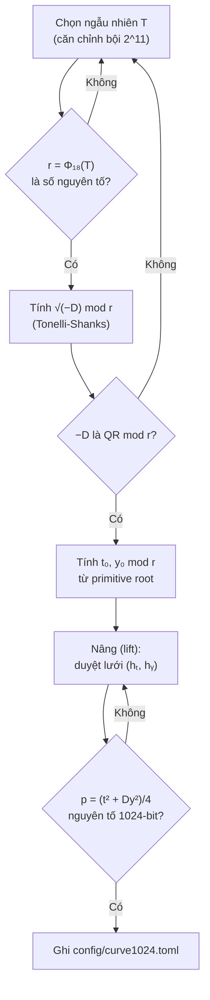
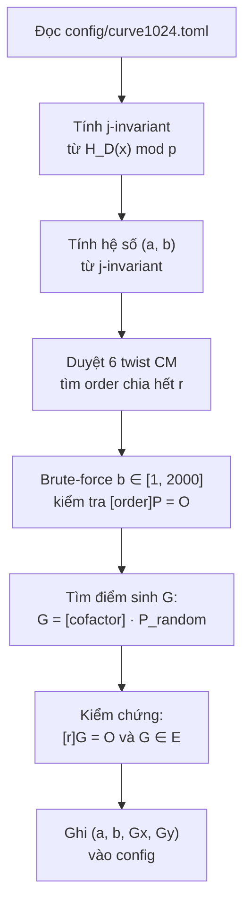

# Tài liệu Examples — Curve1024

## Mục lục

1. [`cocks_pinch.rs`](#1-cocks_pinchrs--bộ-sinh-tham-số-đường-cong)
2. [`complex_multiplication.rs`](#2-complex_multiplicationrs--xây-dựng-đường-cong-và-điểm-sinh)
3. [Giải thích kỹ thuật: Thủ tục "Nâng" (Lifting)](#3-giải-thích-kỹ-thuật-thủ-tục-nâng-lifting)

---

## 1. `cocks_pinch.rs` — Bộ sinh tham số đường cong

> [!NOTE]
> File: [cocks_pinch.rs](file:///home/tranduy/Workspace/curve1024/examples/cocks_pinch.rs)

### Mục đích

Sinh bộ tham số $(p, r, t, y, k, D)$ cho đường cong elliptic pairing-friendly 1024-bit sử dụng phương pháp **Cocks–Pinch**, với:

- **Embedding degree** $k = 18$
- **CM discriminant** $D = 3$
- **Scalar field** $r$ ~ 512-bit, two-adicity $\geq 32$
- **Base field** $p$ ~ 1024-bit, two-adicity $\geq 32$

### Luồng hoạt động



### Chi tiết từng bước

**Bước 1 — Chọn $T$ và tính $r$**

Chương trình chọn ngẫu nhiên $T$ trong khoảng sao cho $r = \Phi_{18}(T) = T^6 - T^3 + 1$ rơi vào đúng 512-bit. Để đảm bảo two-adicity của $r - 1 \geq 32$, $T$ được căn chỉnh thành bội của $2^{\lceil 32/3 \rceil} = 2^{11}$, vì:

$$r - 1 = T^3(T^3 - 1) \implies v_2(r-1) \geq 3 \cdot v_2(T) \geq 3 \times 11 = 33$$

Xem [find_t_range](file:///home/tranduy/Workspace/curve1024/examples/cocks_pinch.rs#L282-L312) và [đoạn căn chỉnh T](file:///home/tranduy/Workspace/curve1024/examples/cocks_pinch.rs#L328-L338).

**Bước 2 — Kiểm tra tính nguyên tố của $r$**

Sử dụng sàng số nguyên tố nhỏ (100 số nguyên tố đầu) rồi kiểm tra Miller-Rabin với 12 witness cố định. Xem [is_prime](file:///home/tranduy/Workspace/curve1024/examples/cocks_pinch.rs#L64-L108).

**Bước 3 — Tìm căn bậc hai $\sqrt{-D} \bmod r$**

Sử dụng thuật toán **Tonelli-Shanks**. Nếu $-D$ không phải thặng dư bậc hai modulo $r$, bỏ qua ứng viên này. Xem [sqrt_mod](file:///home/tranduy/Workspace/curve1024/examples/cocks_pinch.rs#L110-L167).

**Bước 4 — Xây dựng $t_0, y_0$ modulo $r$**

Với mỗi $i$ nguyên tố cùng nhau với $k$:

$$t_0 \equiv T^i + 1 \pmod{r}, \quad y_0 \equiv \frac{t_0 - 2}{\sqrt{-D}} \pmod{r}$$

Xem [vòng lặp gốc nguyên thủy](file:///home/tranduy/Workspace/curve1024/examples/cocks_pinch.rs#L379-L403).

**Bước 5 — Nâng (Lifting)**

Duyệt lưới $(h_t, h_y)$ để tìm số nguyên tố $p$ (chi tiết ở [Mục 3](#3-giải-thích-kỹ-thuật-thủ-tục-nâng-lifting)). Xem [try_lift_to_prime](file:///home/tranduy/Workspace/curve1024/examples/cocks_pinch.rs#L228-L280).

**Bước 6 — Ghi kết quả**

Bộ tham số được serialize thành TOML và ghi ra `config/curve1024.toml`.

### Các thành phần phụ trợ

| Thành phần | Dòng | Mô tả |
|---|---|---|
| [RuntimeField](file:///home/tranduy/Workspace/curve1024/examples/cocks_pinch.rs#L465-L591) | 465–591 | Số học trường hữu hạn runtime dùng **Montgomery multiplication** |
| [cyclotomic_phi18](file:///home/tranduy/Workspace/curve1024/examples/cocks_pinch.rs#L169-L174) | 169–174 | Tính $\Phi_{18}(T) = T^6 - T^3 + 1$ |
| [two_adicity](file:///home/tranduy/Workspace/curve1024/examples/cocks_pinch.rs#L209-L216) | 209–216 | Đếm số mũ lớn nhất $s$ sao cho $2^s \mid n$ |
| [add_2048 / shr_2048](file:///home/tranduy/Workspace/curve1024/examples/cocks_pinch.rs#L176-L191) | 176–191 | Số học 2048-bit (tích $t^2, Dy^2$ vượt 1024-bit) |

---

## 2. `complex_multiplication.rs` — Xây dựng đường cong và điểm sinh

> [!NOTE]
> File: [complex_multiplication.rs](file:///home/tranduy/Workspace/curve1024/examples/complex_multiplication.rs)

### Mục đích

Từ bộ tham số $(p, r, t, y, D)$ đã sinh bởi `cocks_pinch`, xây dựng **phương trình đường cong** $y^2 = x^3 + ax + b$ cùng **điểm sinh** $G$ bậc $r$.

### Luồng hoạt động



### Chi tiết từng bước

**Bước 1 — Tính j-invariant**

Từ đa thức lớp Hilbert $H_D(x)$:

| $D$ | $H_D(x)$ | $j$ |
|---|---|---|
| 3 | $x$ | $0$ |
| 4 | $x - 1728$ | $1728$ |

Xem [j_invariant](file:///home/tranduy/Workspace/curve1024/examples/complex_multiplication.rs#L186-L194).

**Bước 2 — Hệ số đường cong từ j-invariant**

Công thức CM chuẩn:
- $j = 0 \Rightarrow (a, b) = (0, 1)$
- $j = 1728 \Rightarrow (a, b) = (1, 0)$
- Trường hợp tổng quát: $c = j / (1728 - j)$, $(a, b) = (3c, 2c)$

Xem [curve_coeffs_from_j](file:///home/tranduy/Workspace/curve1024/examples/complex_multiplication.rs#L197-L206).

**Bước 3 — Tìm twist đúng**

Đường cong CM có 6 twist ứng viên với các order:

$$\#E = p + 1 - t, \quad p + 1 + t, \quad p + 1 \pm \frac{t + 3y}{2}, \quad p + 1 \pm \frac{t - 3y}{2}$$

Chương trình chọn twist có order chia hết cho $r$, rồi duyệt $b \in [1, 2000]$ để tìm giá trị khiến $[\text{order}] \cdot P = \mathcal{O}$ cho điểm $P$ trên đường cong. Xem [find_twist](file:///home/tranduy/Workspace/curve1024/examples/complex_multiplication.rs#L219-L257).

**Bước 4 — Tìm điểm sinh**

Chọn ngẫu nhiên điểm $P$ trên đường cong, nhân với cofactor: $G = [\text{cofactor}] \cdot P$. Kiểm tra $G \neq \mathcal{O}$ và $[r]G = \mathcal{O}$. Xem [find_generator](file:///home/tranduy/Workspace/curve1024/examples/complex_multiplication.rs#L259-L266).

**Bước 5 — Kiểm chứng và ghi kết quả**

Hai assertion:
1. $[r]G = \mathcal{O}$ — điểm sinh có bậc đúng $r$
2. $G_y^2 = G_x^3 + aG_x + b$ — điểm nằm trên đường cong

Kết quả $(a, b, G_x, G_y)$ được ghi bổ sung vào `config/curve1024.toml`.

---

## 3. Giải thích kỹ thuật: Thủ tục "Nâng" (Lifting)

> [!IMPORTANT]
> Đây là bước then chốt biến kết quả modular thành tham số đường cong thực tế.

### Bản chất

Sau bước Cocks–Pinch, ta có $t_0$ và $y_0$ **chỉ là nghiệm modulo $r$** trong $\mathbb{Z}/r\mathbb{Z}$:

$$t_0 \equiv \zeta^i + 1 \pmod{r}, \quad y_0 \equiv \frac{t_0 - 2}{\sqrt{-D}} \pmod{r}$$

Nhưng để tính $p = (t^2 + Dy^2)/4$, ta cần **số nguyên thực sự**, không phải lớp thặng dư. Bất kỳ đại diện nào của cùng lớp thặng dư đều hợp lệ:

$$t = t_0 + h_t \cdot r, \quad y = y_0 + h_y \cdot r \quad (h_t, h_y \in \mathbb{Z})$$

Mỗi cặp $(h_t, h_y)$ cho một giá trị $p$ khác nhau. Ta cần tìm cặp sao cho:

1. $p$ đúng 1024-bit
2. $p$ là số nguyên tố
3. $p - 1$ có two-adicity $\geq 32$ (NTT-friendly)

### Tại sao $h_t, h_y$ chỉ cần nhỏ?

Vì $r$ ~ 512-bit và $t = t_0 + h_t \cdot r$, thì:

$$p \approx \frac{t^2}{4} \approx \frac{h_t^2 \cdot r^2}{4} \approx h_t^2 \cdot 2^{1022}$$

Để $p$ ~ $2^{1024}$, ta cần $h_t^2 \approx 4$, tức $h_t$ chỉ khoảng $\pm 2$. Tương tự cho $h_y$. Tuy nhiên vì cần kết hợp cả hai chiều $t$ và $y$ cùng thêm ràng buộc nguyên tố + two-adicity, lưới được mở rộng ra hàng chục để đảm bảo tìm được ứng viên.

### Lưới `[-21, 21]` thay vì `[-20, 20]`

Xem [try_lift_to_prime dòng 230–234](file:///home/tranduy/Workspace/curve1024/examples/cocks_pinch.rs#L230-L234):

```rust
let extra = lp
    .min_base_two_adicity       // = 32
    .saturating_sub(lp.r_two_adicity)
    .min(10);
let half_range = 20i64 + (1i64 << extra);
```

Công thức: `half_range = 20 + 2^extra`, trong đó:

$$\texttt{extra} = \min\bigl(\max(0,\; \texttt{min\_base\_two\_adicity} - v_2(r-1)),\; 10\bigr)$$

#### Trường hợp thực tế (cấu hình mặc định)

| Tham số | Giá trị |
|---|---|
| `min_base_two_adicity` | 32 |
| `min_scalar_two_adicity` | 32 |
| Căn chỉnh $T$ | bội $2^{11}$ |
| $v_2(r-1) \geq 3 \times 11$ | $\geq 33$ |
| `extra` | $\max(0, 32 - 33) = 0$ |
| **`half_range`** | **$20 + 2^0 = 21$** |

→ Lưới tìm kiếm: $(h_t, h_y) \in [-21, 21]^2 = 43 \times 43 = 1{,}849$ ứng viên.

#### Ý nghĩa cơ chế bù

Lưới cơ sở $\pm 20$ đủ cho ràng buộc **kích thước bit** (tìm $p$ ~ 1024-bit). Phần $+2^{\texttt{extra}}$ **bù cho ràng buộc two-adicity** của $p$:

- Khi $v_2(r-1) \geq$ yêu cầu: mỗi bước nhảy $h_t \cdot r$ bảo toàn tính chẵn tốt → hầu hết ứng viên đều thỏa → chỉ cần mở thêm 1 ($2^0$).
- Khi $v_2(r-1) <$ yêu cầu: tỉ lệ ứng viên thỏa two-adicity giảm → cần mở rộng lưới theo **cấp số nhân** ($2^1, 2^2, \ldots$) để bù.

| $v_2(r-1)$ | `extra` | `half_range` | Kích thước lưới |
|---|---|---|---|
| $\geq 32$ | 0 | 21 | $43^2 = 1{,}849$ |
| 31 | 1 | 22 | $45^2 = 2{,}025$ |
| 30 | 2 | 24 | $49^2 = 2{,}401$ |
| 22 | 10 | 1044 | $2{,}089^2 \approx 4.4\text{M}$ |

> [!TIP]
> Với cấu hình mặc định ($k=18$, $D=3$, two-adicity $\geq 32$), lưới luôn là $[-21, 21]$ vì $T$ được căn chỉnh đủ tốt để $r$ tự động có $v_2(r-1) \geq 33$.
