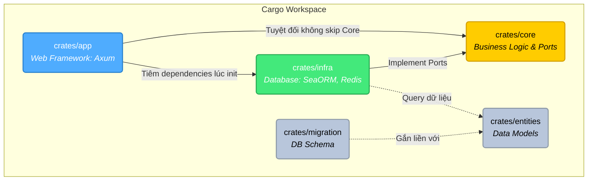

## Giới thiệu

Mình tiếp xúc với Rust đến nay cũng là hai năm rồi. Cách tiếp cận Rust của mình như thế này: xem người khác code như thế nào, code theo, điều chỉnh lại thành ý tưởng của mình. Dù cách này khá hiệu quả thời gian đầu, mình không bị ngợp khi tiếp xúc code mới. Nhưng về lâu dài càng, mình sẽ bị tụt lại dần vì không chịu tìm hiểu các khái niệm, thư viện cũng như các lý thuyết.

Sau khi nhận được feedback từ một vài người phỏng vấn, mình nhận ra đa số các vấn đề họ hỏi, mình đã đều tiếp xúc khi code, vấn đề của mình là không thể nhớ cách dùng, cách hoạt động của các khái niệm, công cụ đó.

Bài này sẽ giải thích các công cụ mình dùng, cách mình triển khai chúng trong một dự án Backend phục vụ E-commerce, là một dự án mình vất vào CV để nhà tuyển dụng biết rằng mình có kiến thức về lập trình web.

## Kiến trúc hệ thống

Một hệ thống web hoàn chỉnh sẽ bao gồm rất nhiều thành phần: xử lý HTTP request, parse JSON, validate dữ liệu, logic nghiệp vụ, gọi Database, thao tác Cache... Nếu nhồi nhét tất cả vào một file `main.rs` hoặc không có sự phân chia ranh giới rõ ràng, code sẽ nhanh chóng trở thành một mớ "mì ý" (spaghetti code), cực kỳ khó để bảo trì, mở rộng hay viết Unit Test.

Để giải quyết bài toán này, mình áp dụng mô hình **Clean Architecture** kết hợp sức mạnh của **Cargo Workspace** có sẵn trong hệ sinh thái Rust.

### Áp dụng Clean Architecture với Cargo Workspace

Clean Architecture nhấn mạnh vào nguyên lý **Dependency Inversion** (Đảo ngược phụ thuộc). Tức là, thay vì logic cốt lõi (Domain/Business logic) phụ thuộc vào những thứ râu ria (Database, Framework, Third-party), thì mọi thứ râu ria phải phụ thuộc ngược lại vào logic cốt lõi.

Rust có một cơ chế tuyệt vời để ép buộc điều này rất tự nhiên: **Cargo Workspace**. Hệ thống build của Rust sẽ kiểm tra gắt gao các dependency giữa các Cargo crate ngay lúc compile (Compile-time). Quy tắc là: tầng `core` không khai báo `sea-orm` hay `redis` trong phần `[dependencies]`, thì bạn sẽ không bao giờ có thể "import nhầm" hoặc vô tình gọi các hàm liên quan đến Database vào trong vùng code nghiệp vụ. Nó gỡ bỏ hoàn toàn nỗi lo developer phá vỡ kiến trúc!

Sơ đồ tổ chức phụ thuộc của dự án:



Dựa vào sơ đồ trên, kiến trúc được mình phận lớp và cài đặt như sau:

- **`crates/core` (Trái tim của dự án)**
  Đây là nơi chứa toàn bộ cốt lõi nghiệp vụ (Business logic): Services (User, Product, Cart), Authentication (JWT), Error Definition, và định nghĩa các **Ports** (các Traits/Interfaces cho các kho chứa dữ liệu). Crate này **KHÔNG** hề biết đến sự tồn tại của Postgres, Redis hay HTTP. Nó đảm bảo logic của hệ thống hoàn toàn cô lập, dễ debug và dễ test nhất.

- **`crates/infra` (Tầng hạ tầng kỹ thuật)**
  Nắm giữ các logic kỹ thuật. Nhiệm vụ của crate này là nhìn vào các yêu cầu (Interface / Ports) do `core` đề ra, và tiến hành cài đặt (Implement) chúng sử dụng các thư viện cụ thể. Nơi đây chứa adapter kết nối Redis, code gọi SeaORM để thao tác dữ liệu. Nếu sau này mình có quyết định đổi Postgres thành MongoDB, thì chỉ việc đụng tới thư mục `infra` này, layer ở `core` và `app` hoàn toàn bất động.

- **`crates/app` (Tầng giao tiếp)**
  Tầng trên cùng, là cửa sổ để hệ thống giao tiếp với thế giới bên ngoài thông qua HTTP Transport. Ở đây tích hợp **Axum**, thiết lập Routing, quản lý AppState, nhận các DTO từ người dùng và tiêm (inject) các implementation từ `infra` vào biến khởi tạo của `core` trong file `main.rs`.

- **`crates/entities` & `crates/migration` (Schema Base)**
  Hai crate này đi liền với sự hỗ trợ từ hệ sinh thái `SeaORM`. Crate `entities` đóng vai trò như một thư viện Type definition cho các table PostgreSQL, trong khi đó `migration` thiết lập công cụ giúp team quản lý được versioning của database.

Nhờ việc chia rẽ triệt để này, mình tự tin kiểm soát được scope của bất kỳ bug nào: Lỗi ở nghiệp vụ thì mò vào `core`, lỗi do query dữ liệu sai thì tìm ở `infra`, còn lỗi do payload HTTP sai định dạng thì tìm ở `app`.

### Web Server & Routing (Giao tiếp HTTP)

#### Vấn đề

Khi xây dựng một hệ thống E-commerce, tầng HTTP là "cổng trước" tiếp nhận mọi request từ client. Mình cần một web framework đáp ứng được:

1. **Hiệu suất cao** — Xử lý hàng ngàn request đồng thời mà không block thread.
2. **Type-safe** — Tận dụng hệ thống type của Rust để bắt lỗi tại compile-time thay vì runtime.
3. **Quản lý routing rõ ràng** — Dễ dàng gom nhóm, versioning API, gắn middleware cho từng nhóm route.

#### Tại sao chọn Axum?

Mình chọn [Axum](https://github.com/tokio-rs/axum) vì những lý do sau:

- **Được phát triển bởi nhóm Tokio** — Axum tích hợp trực tiếp với Tokio runtime, cùng hệ sinh thái `tower` và `hyper`. Điều này đồng nghĩa với việc không có overhead trung gian, mọi thứ chạy native trên async runtime phổ biến nhất của Rust.
- **Không dùng macro** — Khác với Actix-web hay Rocket sử dụng proc-macro để đánh dấu handler (`#[get("/")]`), Axum dùng hệ thống type thuần tuý (trait `FromRequest`, `IntoResponse`). Điều này giúp error message rõ ràng hơn khi compile lỗi, và dễ debug hơn.
- **Extractor pattern** — Đây là tính năng mình thích nhất. Mọi thứ cần thiết cho handler (state, body, query, header, authentication...) đều được "rút ra" từ request thông qua Extractors, compiler sẽ kiểm tra type cho mình.

#### Cấu trúc Routing: Versioning & Module hóa

Trong thực tế, API thường được nhóm theo version (`/api/v1/...`) để dễ dàng nâng cấp mà không break client cũ. Mình tổ chức routing trong file `crates/app/src/router.rs` như sau:

```rust
// crates/app/src/router.rs

use axum::Router;
use super::{handlers, state::AppState};

pub fn create_router(state: AppState) -> Router {
    Router::new().nest("/api/v1", api_routes(state))
}

fn api_routes(state: AppState) -> Router {
    Router::new()
        .nest("/users", handlers::user::routes(state.clone()))
        .nest("/products", handlers::product::routes(state.clone()))
        .nest("/cart", handlers::cart::routes(state.clone()))
        .nest("/checkout", handlers::checkout::routes(state))
}
```

Có hai điều đáng chú ý ở đây:

1. **`.nest()` tạo cây routing phân cấp.** Khi gọi `.nest("/api/v1", api_routes(state))`, mọi route bên trong `api_routes` sẽ tự động có prefix `/api/v1`. Kết quả là ta có các endpoint như `/api/v1/users/register`, `/api/v1/products/all`, `/api/v1/cart/items`... mà không cần lặp lại prefix ở từng handler.

2. **`state.clone()` không tốn kém** — Vì `AppState` chứa toàn `Arc<Service>`, việc clone chỉ tăng reference count (atomic increment), không copy dữ liệu thực.

Mỗi module handler (ví dụ `handlers::cart`) tự định nghĩa route nội bộ của mình, giữ cho `router.rs` gọn gàng:

```rust
// crates/app/src/handlers/cart.rs

pub fn routes(state: AppState) -> Router {
    Router::new()
        .route("/", get(get_cart))
        .route("/items", post(add_item))
        .route("/items/{product_id}", delete(remove_item))
        .with_state(state)
}
```

#### AppState: Chia sẻ tài nguyên một cách an toàn

Một vấn đề quan trọng: **làm sao các handler truy cập được Database Pool, Redis Client, hay các Service?** Câu trả lời là `AppState` — một struct được truyền vào toàn bộ router và mọi handler đều có thể extract ra.

```rust
// crates/app/src/state.rs

use std::sync::Arc;
use app_core::service::{
    auth_service::AuthService, cart_service::CartService,
    checkout_service::CheckoutService, product_service::ProductService,
    user_service::UserService,
};

#[derive(Clone)]
pub struct AppState {
    pub auth_service: Arc<AuthService>,
    pub user_service: Arc<UserService>,
    pub product_service: Arc<ProductService>,
    pub cart_service: Arc<CartService>,
    pub checkout_service: Arc<CheckoutService>,
}
```

Tại sao dùng `Arc<T>` mà không phải `T` trực tiếp? Vì Axum cần `AppState` implement `Clone` để chia sẻ giữa nhiều task async chạy đồng thời. Nếu mỗi Service chứa connection pool bên trong, ta không muốn clone cả pool — `Arc` cho phép nhiều handler **trỏ tới cùng một instance** của Service, và từ đó cùng một connection pool.

Trong `main.rs`, mình "ráp nối" mọi thứ lại:

```rust
// crates/app/src/main.rs (rút gọn)

#[tokio::main]
async fn main() -> anyhow::Result<()> {
    let config = Config::new()?;

    let db_pool = create_connection_pool(&config.database.url).await?;
    let redis_pool = infra::cache::create_connection_pool(&config.redis.url).await?;

    // Khởi tạo các repository adapter (tầng infra)
    let user_repo = Arc::new(SeaOrmUserRepo::new(db_pool.clone()));
    let product_repo = Arc::new(SeaOrmProductRepo::new(db_pool.clone()));
    let cart_repo = Arc::new(RedisCartRepository::new(redis_pool));
    let checkout_repo = Arc::new(SeaOrmCheckoutRepo::new(db_pool.clone()));

    // Khởi tạo các service (tầng core), inject repository vào
    let user_service = Arc::new(UserService::new(user_repo, config.jwt.secret.clone(), event_sender));
    let auth_service = Arc::new(AuthService::new(config.jwt.secret));
    let product_service = Arc::new(ProductService::new(product_repo));
    let cart_service = Arc::new(CartService::new(cart_repo));
    let checkout_service = Arc::new(CheckoutService::new(cart_service.clone(), checkout_repo));

    // Gói tất cả vào AppState
    let app_state = state::AppState {
        auth_service, user_service, product_service,
        cart_service, checkout_service,
    };

    let app = router::create_router(app_state);
    let listener = tokio::net::TcpListener::bind("0.0.0.0:3000").await?;
    axum::serve(listener, app.into_make_service_with_connect_info::<SocketAddr>()).await?;
    Ok(())
}
```

Dòng chảy rất rõ ràng: **Config → Pool → Repository → Service → AppState → Router → Server**. Mỗi tầng chỉ biết tầng ngay bên dưới, đúng nguyên tắc Clean Architecture.

#### Extractors: "Phép thuật" của Axum

Extractor là cách Axum cho phép handler khai báo "tôi cần gì" từ một HTTP request. Compiler sẽ tự động gọi logic extract tương ứng. Nhìn vào handler `add_item`:

```rust
pub async fn add_item(
    State(state): State<AppState>,    // Extract AppState
    JwtAuth(claims): JwtAuth,          // Extract & verify JWT token
    Json(dto): Json<AddCartItemDto>,   // Extract & deserialize JSON body
) -> Result<Json<CartDto>, Error> {
    dto.validate()?;
    let cart = state.cart_service
        .add_item(claims.sub, dto.product_id, dto.quantity)
        .await?;
    Ok(Json(cart))
}
```

Trong một dòng khai báo parameter, Axum tự động thực hiện:
1. **`State(state)`** — Lấy `AppState` đã được gắn vào router.
2. **`JwtAuth(claims)`** — Đọc header `Authorization: Bearer <token>`, verify JWT, trả về `TokenClaims` chứa user ID. Nếu thiếu token hoặc token không hợp lệ → trả về `401 Unauthorized` **ngay lập tức**, handler không bao giờ được gọi.
3. **`Json(dto)`** — Parse request body thành `AddCartItemDto`. Nếu body không hợp lệ → trả về `400 Bad Request`.

Thứ tự extract rất quan trọng: Axum xử lý từ trái qua phải. Nếu `JwtAuth` thất bại, `Json` sẽ không được gọi. Điều này tạo thành một "pipeline guard" tự nhiên.

#### Custom Extractor: JwtAuth

Để tạo extractor riêng, mình implement trait `FromRequestParts` cho struct `JwtAuth`:

```rust
// crates/app/src/extractors/auth.rs

pub struct JwtAuth(pub TokenClaims);

impl<S> FromRequestParts<S> for JwtAuth
where
    S: Send + Sync,
    AppState: FromRef<S>,
{
    type Rejection = (StatusCode, Json<ErrorResponse>);

    async fn from_request_parts(
        parts: &mut Parts, state: &S
    ) -> Result<Self, Self::Rejection> {
        let app_state = AppState::from_ref(state);

        // Bước 1: Lấy Bearer token từ header
        let TypedHeader(Authorization(bearer)) =
            TypedHeader::<Authorization<Bearer>>::from_request_parts(parts, state)
                .await
                .map_err(|_| (StatusCode::UNAUTHORIZED, Json(ErrorResponse {
                    status: "fail".to_string(),
                    message: "Authorization header missing".to_string(),
                })))?;

        // Bước 2: Verify token bằng AuthService
        let claims = app_state.auth_service
            .verify_token(bearer.token())
            .map_err(|e| (StatusCode::UNAUTHORIZED, Json(ErrorResponse {
                status: "fail".to_string(),
                message: format!("Invalid JWT token: {}", e),
            })))?;

        Ok(JwtAuth(claims))
    }
}
```

Điều hay ho ở đây là `JwtAuth` sử dụng `AppState::from_ref(state)` để lấy `AuthService` — nghĩa là logic verify token nằm hoàn toàn ở tầng `core`, không bị ràng buộc với HTTP framework. Nếu mai sau mình đổi sang framework khác, logic xác thực không cần viết lại.

Khi muốn bảo vệ một route, chỉ cần thêm `JwtAuth(claims): JwtAuth` vào tham số handler — không cần cấu hình middleware riêng, không cần decorator. Nhìn lại bảng route ở trên, các endpoint Cart và Checkout đều có `JwtAuth`, trong khi User và Product thì không. Sự phân biệt này được thể hiện rõ ràng ngay trong function signature.


### Tương tác Cơ sở dữ liệu & Caching (Data Persistence)

#### Vấn đề 1: Tương tác an toàn với PostgreSQL

Khi xây dựng một ứng dụng back-end, tương tác với Database là việc bắt buộc. Nhưng để hệ thống sống sót trên môi trường Production, mình phải đảm bảo:
- **An toàn:** Tránh các lỗi liên quan đến SQL Injection.
- **Tiện lợi:** Map được dữ liệu từ các table của SQL về các Struct (Object) của Rust.
- **Dễ bảo trì:** Quản lý được phiên bản database schema (Migrations) để làm việc với các thành viên khác trong team hoặc deploy lên server.

#### Giải pháp 1: Dùng SeaORM - Async ORM mạnh mẽ của Rust

Sau khi cân nhắc giữa `sqlx` (viết raw query) và `SeaORM`, mình đã quyết định [SeaORM](https://www.sea-ql.org/SeaORM/). Đây là một async ORM hỗ trợ hoàn hảo cho hệ sinh thái của `tokio`. 

**1. Quản lý database schema bằng Migrations**

Trong `shopping-cart`, mình tách biệt thư mục `crates/migration` để chịu trách nhiệm chuyên biệt cho việc lên schema. Mỗi khi muốn thêm bảng, mình chỉ cần dùng SeaORM CLI để tạo ra một file migration. 

Ví dụ việc tạo bảng `Product`:

```rust
// crates/migration/src/m20250918_025202_create_table_product.rs

use sea_orm_migration::prelude::*;

#[derive(DeriveMigrationName)]
pub struct Migration;

#[async_trait::async_trait]
impl MigrationTrait for Migration {
    async fn up(&self, manager: &SchemaManager) -> Result<(), DbErr> {
        manager.create_table(
            Table::create()
                .table(Product::Table)
                .if_not_exists()
                .col(ColumnDef::new(Product::Id).big_integer().primary_key().auto_increment())
                .col(ColumnDef::new(Product::Name).string_len(255).not_null())
                .col(ColumnDef::new(Product::Price).decimal_len(10, 2).check(Expr::col(Product::Price).gte(0)))
                // ... các cột khác được lược bỏ cho gọn
                .to_owned()
        ).await
    }
    
    async fn down(&self, manager: &SchemaManager) -> Result<(), DbErr> {
        manager.drop_table(Table::drop().table(Product::Table).to_owned()).await
    }
}

#[derive(DeriveIden)]
enum Product {
    Table,
    Id,
    Name,
    Price,
}
```

Nhờ viết bằng Rust, IDE sẽ kiểm tra lỗi giùm mình thay vì viết text raw SQL rất dễ bị sai đánh máy. Function `up()` được chạy khi update DB, và `down()` được chạy nếu muốn rollback (rất tiện để dọn deẹp DB).

**2. CRUD dữ liệu với Repository Pattern**

Việc tương tác dữ liệu mình cài đặt nó trong `crates/infra/src/database/`. Ví dụ với hàm lấy danh sách bảng `Product` có hỗ trợ phân trang (Pagination):

```rust
// crates/infra/src/database/product_repo.rs

impl ProductRepository for SeaOrmProductRepo {
    async fn get_all(
        &self,
        page: u64,
        page_size: u64,
    ) -> Result<(Vec<product::Model>, u64), Error> {
        
        let paginator = product::Entity::find()
            .order_by_asc(product::Column::Name)
            .paginate(&self.db, page_size);

        let num_pages = paginator.num_pages().await.map_err(Error::from)?;
        let products = paginator.fetch_page(page - 1).await.map_err(Error::from)?;

        Ok((products, num_pages))
    }
}
```

SeaORM cung cấp sẵn API `.paginate()`, vì thế mình không cần viết câu lệnh `LIMIT` / `OFFSET` bằng tay và không cần tự `COUNT()` tổng số kết quả, giảm được code lặp lại (boilerplate) đáng kể.

#### Vấn đề 2: Dữ liệu tạm thời (Giỏ hàng) gọi vào DB quá nhiều

Trong domain của E-Commerce, mình nhận ra: **Giỏ hàng (Cart) của User thay đổi liên tục**. 

User sẽ thêm, sửa, xoá sản phẩm khỏi giỏ hàng rất nhiều lần trước khi họ thực sự ấn "Thanh toán" (Checkout). Nếu với mọi thao tác thêm/bớt ấy, hệ thống đều chọc xuống PostgreSQL để thực hiện INSERT/UPDATE thì chẳng mấy chốc Database sẽ bị chịu tải vô ích đối với luồng dữ liệu ít quan trọng này. 

#### Giải pháp 2: Sử dụng Redis làm Caching Layer cho Cart

Thay vì lưu Cart vào PostgreSQL, mình chọn dùng **Redis**. Redis lưu dữ liệu trực tiếp trên RAM của server nên mang lại tốc độ Read/Write gần như tức thời và làm giảm tải cực lớn cho database chính.

Trong project, mình cài đặt tại `crates/infra/src/cache/cart_repo.rs`, sử dụng crate `redis`:

```rust
// crates/infra/src/cache/cart_repo.rs

use redis::AsyncCommands;

impl CartRepository for RedisCartRepository {
    async fn save(&self, cart: CartDto) -> Result<(), Error> {
        let key = format!("cart:{}", cart.user_id);
        let mut conn = self.pool.clone();

        // Object giỏ hàng được Serialize lại thành chuỗi JSON
        let json = serde_json::to_string(&cart)
            .map_err(|_| Error::internal("Serialization failed".to_string()))?;

        // Lưu thông tin vào Redis, thiết lập thời gian hết hạn là 24 giờ
        let _: () = conn.set_ex(key, json, 24 * 60 * 60)
            .await
            .map_err(|_| Error::internal("Cache error".to_string()))?;

        Ok(())
    }
    
    async fn get_by_user_id(&self, user_id: i64) -> Result<Option<CartDto>, Error> {
        let key = format!("cart:{}", user_id);
        let mut conn = self.pool.clone();

        let data: Option<String> = conn.get(key)
            .await
            .map_err(|_| Error::internal("Cache error".to_string()))?;

        match data {
            // Lấy ra và Deserialize JSON ngược lại thành Struct CartDto của Rust
            Some(json) => serde_json::from_str(&json)
                .map_err(|_| Error::internal("Data corruption".to_string())),
            None => Ok(None),
        }
    }
}
```

Điểm hay của thiết kế này:
1. **TTL (Time-To-Live):** Cùng với lệnh lưu `.set_ex()`, mình setup dữ liệu giỏ hàng sẽ tự động bị phân huỷ trong `24 * 60 * 60` giây (tức 24 giờ). Nếu User hôm nay tạo giỏ mà lại không mua, khối dữ liệu đó sẽ tự động bốc hơi, giải phóng bộ nhớ đáng quý của RAM (tránh lãng phí).
2. **Serialization (Serde):** Nhờ cơ chế cực kỳ xịn xò của cặp đôi Serde `Serialize / Deserialize`, mình dễ dàng dùng `serde_json::to_string` để "đóng gói" toàn bộ cái Array giỏ hàng của Client thành 1 chuỗi String duy nhất để tống vào Redis, và lúc cần thiết thì lại dùng `serde_json::from_str` để "bật" nó ngược lại thành một Struct Rust hoàn chỉnh một cách an toàn.

#### V. Thành phần 4: Ràng buộc Dữ liệu & Tính đúng đắn (Validation & Business Logic)

- **Vấn đề:** "Never trust user input" (Không bao giờ tin tưởng dữ liệu đầu vào). Cần lọc dữ liệu rác trước khi đưa xuống Database, đồng thời phải giải quyết các logic nghiệp vụ phức tạp (như xử lý tính toán số lượng tồn kho, gộp sản phẩm trùng trong giỏ).
    
- **Cách tôi giải quyết:**
    
    - Sử dụng crate `validator` tại tầng DTO (Data Transfer Object) để kiểm tra: độ dài chuỗi, giá trị lớn hơn 0... ngay tại HTTP Handler.
        
    - Trình bày ngắn gọn một đoạn logic nghiệp vụ thú vị mà bạn đã code (ví dụ: Logic `merge_cart_items` hoặc quá trình `checkout`).
        

#### VI. Thành phần 5: Nghệ thuật Xử lý Lỗi (Error Handling)

- **Vấn đề:** Ứng dụng Rust không nên `unwrap()` và crash (panic). Cần xử lý lỗi triệt để, log lại lỗi chi tiết cho backend dev (chẩn đoán), nhưng chỉ trả về HTTP status code chuẩn mực (400, 401, 500) và câu thông báo an toàn cho frontend.
    
- **Cách tôi giải quyết:**
    
    - Sử dụng `thiserror` định nghĩa các Enum lỗi ở tầng `core`.
        
    - Tận dụng sức mạnh của trait `IntoResponse` trong Axum để tự động "biến hình" từ một lỗi nội bộ (như Lỗi SQL) thành một JSON Error Response có cấu trúc thống nhất.
        

#### VII. Thành phần 6: Độ tin cậy (Testing & CI/CD)

- **Vấn đề:** Làm sao để tự tin khi refactor code? Làm sao để đảm bảo code đẩy lên Github luôn build được?
    
- **Cách tôi giải quyết:**
    
    - Viết **Integration Tests** (như trong `crates/app/tests/`) để kiểm thử dòng chảy (flow) từ API gọi xuống DB giả lập.
        
    - Sử dụng **GitHub Actions** (chỉ ra file `.github/workflows/ci.yml`) để tự động chạy Format, Lint (Clippy) và Test mỗi khi có commit mới.
        

#### VIII. Kết luận

- **Nhìn lại hành trình:** Viết backend Rust đòi hỏi phải setup nhiều mảnh ghép lúc ban đầu (boilerplate) hơn so với các ngôn ngữ như Node.js/Python, nhưng bù lại, hệ thống cực kỳ an toàn, rõ ràng và hiệu suất cao.
    
- **Lời khuyên:** Khuyên người mới đọc tài liệu (như các sách về Rust Web), chia nhỏ bài toán, sử dụng Clean Architecture.
    
- **Kêu gọi (Call to action):** Cung cấp link Github dự án để mọi người tham khảo và đóng góp.


